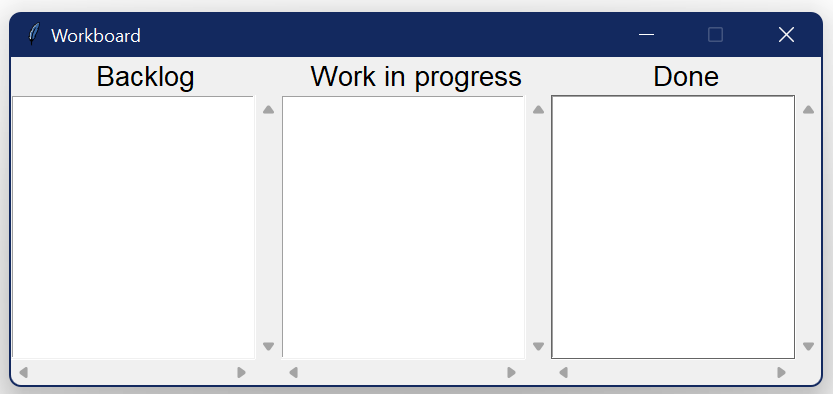
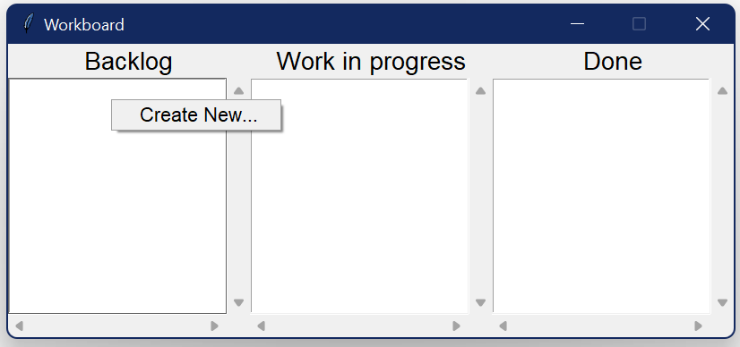
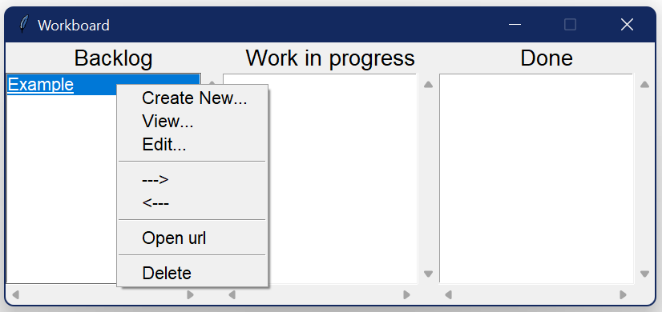
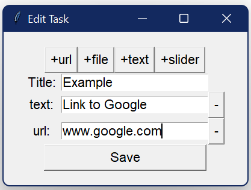
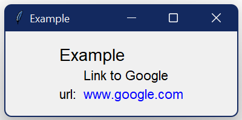
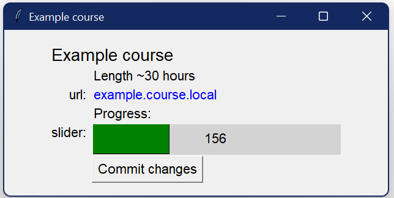
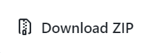

## Workboard

A very simple program to make it easier to find things that are working on or to keep track of where you are in a course.

1. [Usage](#Usage)

2. [Installation](#Installation)

### Usage



_Image of how the program looks when first opened_

Most of the interactions with the board is done trought a right click menu



_Image of menu when the board is empty_



_Image of menu_



_Image of the creation and edit window_



_Image of the view window (can also be accessed with double left click)_



_Image of a view window with a slider_

### Installation

#### Windows

Prerequirements:

* Python 3.10 (not tested on older versions)

##### Metode 1

Clone the repository with git

```git
git clone https://github.com/Lavhran/workboard.git
```

##### Metode 2

Download a ZIP of the code




